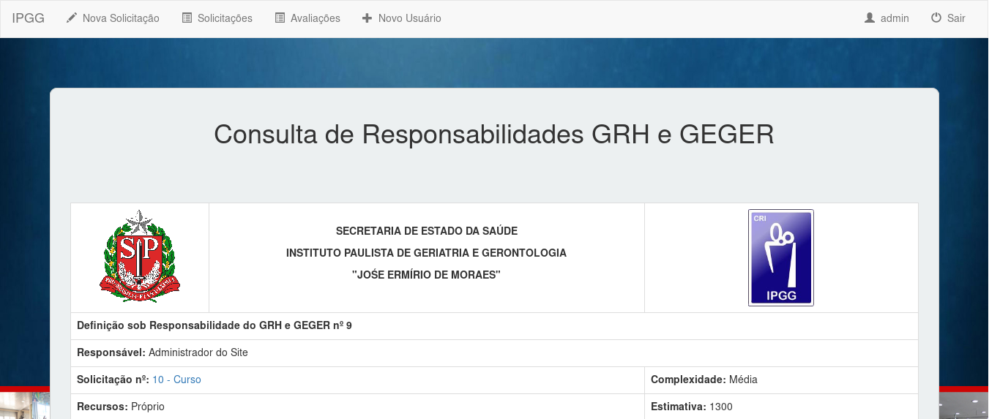

# ipgg-solicitacao
Sistema web para solicitação de cursos internos do **Instituto Paulista de Geriatria e Gerontologia "José Ermírio de Moraes"** (IPGG - JEM).

Código do sistema disponível para estudo, consulta e modificação. Mas o mesmo pertence ao IPGG — uma organização da Secretaria de Saúde do Governo do Estado de São Paulo.

## Função do Sistema
Realizar o cadastro de solicitação de cursos internos para a unidade, bem como a avaliação sobre eles.

## Aparência
Página inicial do sistema, se autenticado.

	</img>

## Autentificação
Só é permitido o uso do sistema aos usuários autenticados.

	</img>

## Solicitação
Qualquer usuário autenticado, de qualquer setor, pode realizar a solicitação de um evento interno.

	</img>

A solicitação pode ser visualizada depois, na lista de solicitações. Ela terá essa aparência:

	</img>

## Lista de Solicitações
Um usuário não-avaliador pode visualizar todas as solicitações já feitas e o *status* delas.

	</img>

Um usuário avaliador, além das permissões anteriores, pode excluir uma solicitação ou avaliá-la.

	</img>

## Perfil de Usuário
As informações sobre o perfil do usuário ficam disponíveis através do menu superior, onde se encontra seu *nick* de *login*.

	</img>

Um usuário sem cadastro no sistema pode ser cadastrado por um administrador.

	</img>

## Avaliação
Um usuário autenticado como avaliador é capaz de avaliar uma solicitação através dessa página. A solicitação deve existir e só é possível uma solicitação receber **uma** avaliação. Caso a solicitação avaliada seja excluída, sua avaliação também será.

	</img>

A avaliação pode ser visualizada depois, na lista de avaliações. Ela terá a seguinte aparência:

	</img>

## Lista de Avaliações
Os avaliadores podem visualizar a lista de avaliações através de uma página, no menu também.

	</img>

## Notas de Uso
* **Django**: instale uma versão do Django >= 2.0
* **Migrações**: antes de iniciar a aplicação é necessário rodar ``python manage.py makemigrations solicitacao`` para criar as tabelas e ``python manage.py migrate`` para realizar a migração
* **Usuários**: só é possível registrar um usuário se o **setor** e **gerência** corretos estiverem salvos na base de dados.
* **Admin**: não esqueça de criar um usuário admin e um grupo chamado **avaliador**.

**TODO** Configuração do servidor para fornecer a aplicação com arquivos estáticos usando Gunicorn e Nginx.
